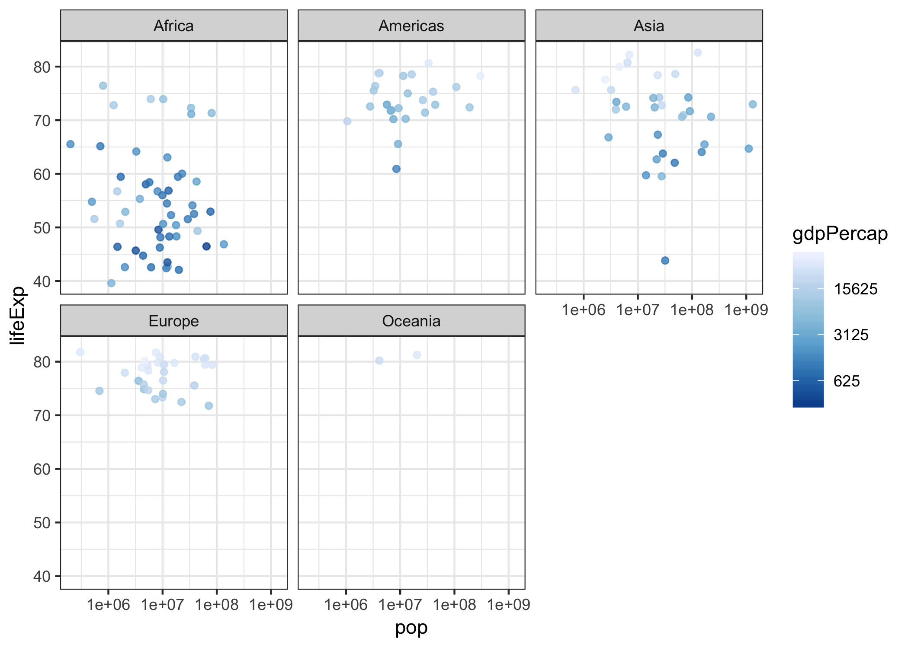

```{r}
suppressPackageStartupMessages(library(tidyverse))
suppressPackageStartupMessages(library(gapminder))
```
# Part 1: Factor management

## Elaboration for the gapminder data set
### 1.Drop Oceania
Let's grab a sense of the gapminder at first:
```{r}
# A summary of the gapmainder
str(gapminder)
# see what's going on inside by just showing the head rows:
knitr::kable(head(gapminder,15))
```

And check the continent levels in gapminder:
```{r}
levels(gapminder$continent)
```

Now let's drop 'Oceania', and see what will happen:
```{r}
gap_drop <- gapminder %>% 
  filter(continent != 'Oceania')
```

```{r}
str(gap_drop)
levels(gap_drop$continent)
```

It seems 24 rows have been removed (from 1704 to 1680). But the number of continent levels is still 5. And the "Oceania" level itself still exists. To verify that "Oceania" related rows were indeed dropped, let's count the "Ociania" rows in gapminder and gap_drop:
```{r}
gapminder %>% 
  filter(continent == "Oceania") %>% 
  count()
gap_drop %>% 
  filter(continent == "Oceania") %>% 
  count()
```

To get rid of the unused "Oceania" level:
```{r}
drop1 <- gap_drop %>% 
  # operates on all the factors
  droplevels()
str(drop1)
levels(drop1$continent)
```
```{r}
drop2 <- gap_drop$continent %>% 
  # operates on a factor
  fct_drop()
str(drop2)
levels(drop2)
```

Now we do have 4 continent levels.

### 2.Reorder the levels of country or continent.
Let's try different orders.
Here I pick a frame of the countries with pop larger than one billion in 2007:
```{r}
gap_sub <- gapminder %>% 
  filter(year == 2007 & pop > 100000000) %>% 
  droplevels()
knitr::kable(gap_sub)
```

Order according to mean of lifeExp:
```{r}
gap_sub %>% 
  mutate(country = fct_reorder(country, lifeExp, mean)) %>% 
  knitr::kable()
```


And plot them above:
```{r}
ggplot(gap_sub, aes(x = lifeExp, y = country, colour=country)) + 
  geom_point()
ggplot(gap_sub, aes(x = lifeExp, y = fct_reorder(country, lifeExp, mean),colour=country)) + 
  geom_point()
```

We can notice that the order of the y-axis has changed. While the table was still shown in original order.

So what if we use arrange()?
```{r}
gap_sub_arrange <- gap_sub %>%
  arrange(lifeExp)
knitr::kable(gap_sub_arrange)
ggplot(gap_sub_arrange,aes(x = lifeExp, y = country, colour=country)) +
  geom_point()
```

If we arrange by lifeExp, we get the same order of countries in plot. But the order in figure has changed.

What if arrange() and fct_reorder() are combined?
```{r}
gap_sub %>%
  arrange(lifeExp) %>% 
  mutate(country = fct_reorder(country, lifeExp, mean)) %>% 
  knitr::kable() 
gap_sub %>% 
  arrange(lifeExp) %>% 
  ggplot(aes(x = lifeExp, y = fct_reorder(country, lifeExp, mean), colour=country)) +
  geom_point()
```

Both are reordered.

## Part 2: File I/O
Let's reuse the gap_sub we've created in last part.
### write_csv()/read_csv()
```{r}
gap_write <-gap_sub %>%
  arrange(lifeExp) %>% 
  mutate(country = fct_reorder(country, lifeExp, mean)) 
str(gap_write)
knitr::kable(gap_write)

```
```{r}
write_csv(gap_write, "gap_write.csv")
gap_read_csv <- read_csv("gap_write.csv")
knitr::kable(gap_read_csv)
```

When reading a dataframe, write_csv() parses column with types. After read_csv(), the data keeps the same as before.

### saveRDS()/readRDS()
```{r}
saveRDS(gap_write, "gap_save.rds")
gap_read_rds <- readRDS("gap_save.rds")
knitr::kable(gap_read_rds)
```

The data  survives the round trip.
### dput()/dget()
```{r}
dput(gap_write, "gap_put.txt")
gap_get_txt <- dget("gap_put.txt")
knitr::kable(gap_get_txt)
```

Also a great trip with data survived.

## Part 3: Visualization design
Let's make a plot with ggplot() first:
```{r}
(plot <- gapminder %>% 
     filter(year==2007) %>% 
     ggplot(aes(pop, lifeExp)) +
     geom_point(aes(colour=gdpPercap), alpha=0.8) +
     scale_x_log10() +
     scale_colour_distiller(
         trans   = "log10",
         breaks  = 5^(1:20),
         palette = "Blues"
     ) +
     facet_wrap(~ continent) +
     scale_y_continuous(breaks=10*(1:10)) +
     theme_bw()) +
    theme(axis.text  = element_text(size=6),
          strip.background = element_rect(fill = "lightblue"),
    )
```

Now convert it to a `plotly` object:
```{r}
library(plotly)
ggplotly(plot)
```

Now we can select and zoom the plot, with exact data when hovering. We can also autoscale it to make the plot more focused. It is also possible to move each graph up and down, right and left.
Or view it in 3-d format:
```{r}
gapminder %>% 
filter(year==2007) %>% 
  plot_ly( 
        x = ~pop, 
        y = ~lifeExp, 
        z = ~gdpPercap,
        type = "scatter3d",
        mode = "markers",
        opacity = 0.2)
```

## Part 4: Writing figures to file

Save the plot we made in part3:
```{r}
ggsave("plot.png",plot)
```
 

