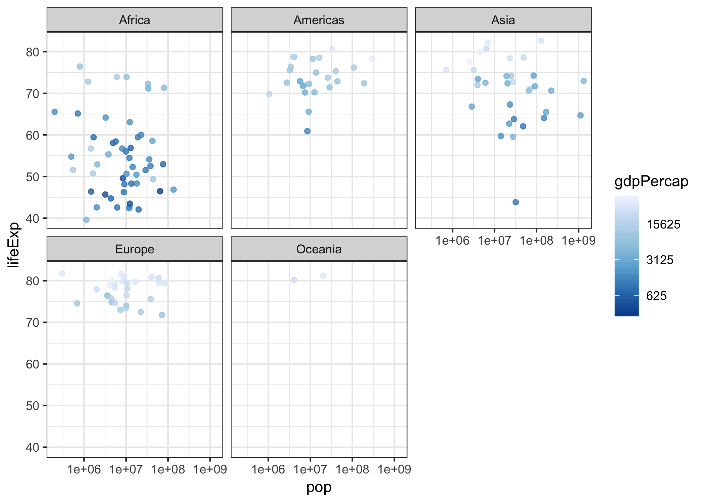

hw05-gapminder
================

``` r
suppressPackageStartupMessages(library(tidyverse))
suppressPackageStartupMessages(library(gapminder))
```

Part 1: Factor management
=========================

Elaboration for the gapminder data set
--------------------------------------

### 1.Drop Oceania

Let's grab a sense of the gapminder at first:

``` r
# A summary of the gapmainder
str(gapminder)
```

    ## Classes 'tbl_df', 'tbl' and 'data.frame':    1704 obs. of  6 variables:
    ##  $ country  : Factor w/ 142 levels "Afghanistan",..: 1 1 1 1 1 1 1 1 1 1 ...
    ##  $ continent: Factor w/ 5 levels "Africa","Americas",..: 3 3 3 3 3 3 3 3 3 3 ...
    ##  $ year     : int  1952 1957 1962 1967 1972 1977 1982 1987 1992 1997 ...
    ##  $ lifeExp  : num  28.8 30.3 32 34 36.1 ...
    ##  $ pop      : int  8425333 9240934 10267083 11537966 13079460 14880372 12881816 13867957 16317921 22227415 ...
    ##  $ gdpPercap: num  779 821 853 836 740 ...

``` r
# see what's going on inside by just showing the head rows:
knitr::kable(head(gapminder,15))
```

| country     | continent |  year|  lifeExp|       pop|  gdpPercap|
|:------------|:----------|-----:|--------:|---------:|----------:|
| Afghanistan | Asia      |  1952|   28.801|   8425333|   779.4453|
| Afghanistan | Asia      |  1957|   30.332|   9240934|   820.8530|
| Afghanistan | Asia      |  1962|   31.997|  10267083|   853.1007|
| Afghanistan | Asia      |  1967|   34.020|  11537966|   836.1971|
| Afghanistan | Asia      |  1972|   36.088|  13079460|   739.9811|
| Afghanistan | Asia      |  1977|   38.438|  14880372|   786.1134|
| Afghanistan | Asia      |  1982|   39.854|  12881816|   978.0114|
| Afghanistan | Asia      |  1987|   40.822|  13867957|   852.3959|
| Afghanistan | Asia      |  1992|   41.674|  16317921|   649.3414|
| Afghanistan | Asia      |  1997|   41.763|  22227415|   635.3414|
| Afghanistan | Asia      |  2002|   42.129|  25268405|   726.7341|
| Afghanistan | Asia      |  2007|   43.828|  31889923|   974.5803|
| Albania     | Europe    |  1952|   55.230|   1282697|  1601.0561|
| Albania     | Europe    |  1957|   59.280|   1476505|  1942.2842|
| Albania     | Europe    |  1962|   64.820|   1728137|  2312.8890|

And check the continent levels in gapminder:

``` r
levels(gapminder$continent)
```

    ## [1] "Africa"   "Americas" "Asia"     "Europe"   "Oceania"

Now let's drop 'Oceania', and see what will happen:

``` r
gap_drop <- gapminder %>% 
  filter(continent != 'Oceania')
```

``` r
str(gap_drop)
```

    ## Classes 'tbl_df', 'tbl' and 'data.frame':    1680 obs. of  6 variables:
    ##  $ country  : Factor w/ 142 levels "Afghanistan",..: 1 1 1 1 1 1 1 1 1 1 ...
    ##  $ continent: Factor w/ 5 levels "Africa","Americas",..: 3 3 3 3 3 3 3 3 3 3 ...
    ##  $ year     : int  1952 1957 1962 1967 1972 1977 1982 1987 1992 1997 ...
    ##  $ lifeExp  : num  28.8 30.3 32 34 36.1 ...
    ##  $ pop      : int  8425333 9240934 10267083 11537966 13079460 14880372 12881816 13867957 16317921 22227415 ...
    ##  $ gdpPercap: num  779 821 853 836 740 ...

``` r
levels(gap_drop$continent)
```

    ## [1] "Africa"   "Americas" "Asia"     "Europe"   "Oceania"

It seems 24 rows have been removed (from 1704 to 1680). But the number of continent levels is still 5. And the "Oceania" level itself still exists. To verify that "Oceania" related rows were indeed dropped, let's count the "Ociania" rows in gapminder and gap\_drop:

``` r
gapminder %>% 
  filter(continent == "Oceania") %>% 
  count()
```

    ## # A tibble: 1 x 1
    ##       n
    ##   <int>
    ## 1    24

``` r
gap_drop %>% 
  filter(continent == "Oceania") %>% 
  count()
```

    ## # A tibble: 1 x 1
    ##       n
    ##   <int>
    ## 1     0

To get rid of the unused "Oceania" level:

``` r
drop1 <- gap_drop %>% 
  # operates on all the factors
  droplevels()
str(drop1)
```

    ## Classes 'tbl_df', 'tbl' and 'data.frame':    1680 obs. of  6 variables:
    ##  $ country  : Factor w/ 140 levels "Afghanistan",..: 1 1 1 1 1 1 1 1 1 1 ...
    ##  $ continent: Factor w/ 4 levels "Africa","Americas",..: 3 3 3 3 3 3 3 3 3 3 ...
    ##  $ year     : int  1952 1957 1962 1967 1972 1977 1982 1987 1992 1997 ...
    ##  $ lifeExp  : num  28.8 30.3 32 34 36.1 ...
    ##  $ pop      : int  8425333 9240934 10267083 11537966 13079460 14880372 12881816 13867957 16317921 22227415 ...
    ##  $ gdpPercap: num  779 821 853 836 740 ...

``` r
levels(drop1$continent)
```

    ## [1] "Africa"   "Americas" "Asia"     "Europe"

``` r
drop2 <- gap_drop$continent %>% 
  # operates on a factor
  fct_drop()
str(drop2)
```

    ##  Factor w/ 4 levels "Africa","Americas",..: 3 3 3 3 3 3 3 3 3 3 ...

``` r
levels(drop2)
```

    ## [1] "Africa"   "Americas" "Asia"     "Europe"

Now we do have 4 continent levels.

### 2.Reorder the levels of country or continent.

Let's try different orders. Here I pick a frame of the countries with pop larger than one billion in 2007:

``` r
gap_sub <- gapminder %>% 
  filter(year == 2007 & pop > 100000000) %>% 
  droplevels()
knitr::kable(gap_sub)
```

| country       | continent |  year|  lifeExp|         pop|  gdpPercap|
|:--------------|:----------|-----:|--------:|-----------:|----------:|
| Bangladesh    | Asia      |  2007|   64.062|   150448339|   1391.254|
| Brazil        | Americas  |  2007|   72.390|   190010647|   9065.801|
| China         | Asia      |  2007|   72.961|  1318683096|   4959.115|
| India         | Asia      |  2007|   64.698|  1110396331|   2452.210|
| Indonesia     | Asia      |  2007|   70.650|   223547000|   3540.652|
| Japan         | Asia      |  2007|   82.603|   127467972|  31656.068|
| Mexico        | Americas  |  2007|   76.195|   108700891|  11977.575|
| Nigeria       | Africa    |  2007|   46.859|   135031164|   2013.977|
| Pakistan      | Asia      |  2007|   65.483|   169270617|   2605.948|
| United States | Americas  |  2007|   78.242|   301139947|  42951.653|

Order according to mean of lifeExp:

``` r
gap_sub %>% 
  mutate(country = fct_reorder(country, lifeExp, mean)) %>% 
  knitr::kable()
```

| country       | continent |  year|  lifeExp|         pop|  gdpPercap|
|:--------------|:----------|-----:|--------:|-----------:|----------:|
| Bangladesh    | Asia      |  2007|   64.062|   150448339|   1391.254|
| Brazil        | Americas  |  2007|   72.390|   190010647|   9065.801|
| China         | Asia      |  2007|   72.961|  1318683096|   4959.115|
| India         | Asia      |  2007|   64.698|  1110396331|   2452.210|
| Indonesia     | Asia      |  2007|   70.650|   223547000|   3540.652|
| Japan         | Asia      |  2007|   82.603|   127467972|  31656.068|
| Mexico        | Americas  |  2007|   76.195|   108700891|  11977.575|
| Nigeria       | Africa    |  2007|   46.859|   135031164|   2013.977|
| Pakistan      | Asia      |  2007|   65.483|   169270617|   2605.948|
| United States | Americas  |  2007|   78.242|   301139947|  42951.653|

And plot them above:

``` r
ggplot(gap_sub, aes(x = lifeExp, y = country, colour=country)) + 
  geom_point()
```


``` r
ggplot(gap_sub, aes(x = lifeExp, y = fct_reorder(country, lifeExp, mean),colour=country)) + 
  geom_point()
```


We can notice that the order of the y-axis has changed. While the table was still shown in original order.

So what if we use arrange()?

``` r
gap_sub_arrange <- gap_sub %>%
  arrange(lifeExp)
knitr::kable(gap_sub_arrange)
```

| country       | continent |  year|  lifeExp|         pop|  gdpPercap|
|:--------------|:----------|-----:|--------:|-----------:|----------:|
| Nigeria       | Africa    |  2007|   46.859|   135031164|   2013.977|
| Bangladesh    | Asia      |  2007|   64.062|   150448339|   1391.254|
| India         | Asia      |  2007|   64.698|  1110396331|   2452.210|
| Pakistan      | Asia      |  2007|   65.483|   169270617|   2605.948|
| Indonesia     | Asia      |  2007|   70.650|   223547000|   3540.652|
| Brazil        | Americas  |  2007|   72.390|   190010647|   9065.801|
| China         | Asia      |  2007|   72.961|  1318683096|   4959.115|
| Mexico        | Americas  |  2007|   76.195|   108700891|  11977.575|
| United States | Americas  |  2007|   78.242|   301139947|  42951.653|
| Japan         | Asia      |  2007|   82.603|   127467972|  31656.068|

``` r
ggplot(gap_sub_arrange,aes(x = lifeExp, y = country, colour=country)) +
  geom_point()
```


If we arrange by lifeExp, we get the same order of countries in plot. But the order in figure has changed.

What if arrange() and fct\_reorder() are combined?

``` r
gap_sub %>%
  arrange(lifeExp) %>% 
  mutate(country = fct_reorder(country, lifeExp, mean)) %>% 
  knitr::kable() 
```

| country       | continent |  year|  lifeExp|         pop|  gdpPercap|
|:--------------|:----------|-----:|--------:|-----------:|----------:|
| Nigeria       | Africa    |  2007|   46.859|   135031164|   2013.977|
| Bangladesh    | Asia      |  2007|   64.062|   150448339|   1391.254|
| India         | Asia      |  2007|   64.698|  1110396331|   2452.210|
| Pakistan      | Asia      |  2007|   65.483|   169270617|   2605.948|
| Indonesia     | Asia      |  2007|   70.650|   223547000|   3540.652|
| Brazil        | Americas  |  2007|   72.390|   190010647|   9065.801|
| China         | Asia      |  2007|   72.961|  1318683096|   4959.115|
| Mexico        | Americas  |  2007|   76.195|   108700891|  11977.575|
| United States | Americas  |  2007|   78.242|   301139947|  42951.653|
| Japan         | Asia      |  2007|   82.603|   127467972|  31656.068|

``` r
gap_sub %>% 
  arrange(lifeExp) %>% 
  ggplot(aes(x = lifeExp, y = fct_reorder(country, lifeExp, mean), colour=country)) +
  geom_point()
```


Both are reordered.

Part 2: File I/O
----------------

Let's reuse the gap\_sub we've created in last part. \#\#\# write\_csv()/read\_csv()

``` r
gap_write <-gap_sub %>%
  arrange(lifeExp) %>% 
  mutate(country = fct_reorder(country, lifeExp, mean)) 
str(gap_write)
```

    ## Classes 'tbl_df', 'tbl' and 'data.frame':    10 obs. of  6 variables:
    ##  $ country  : Factor w/ 10 levels "Nigeria","Bangladesh",..: 1 2 3 4 5 6 7 8 9 10
    ##  $ continent: Factor w/ 3 levels "Africa","Americas",..: 1 3 3 3 3 2 3 2 2 3
    ##  $ year     : int  2007 2007 2007 2007 2007 2007 2007 2007 2007 2007
    ##  $ lifeExp  : num  46.9 64.1 64.7 65.5 70.7 ...
    ##  $ pop      : int  135031164 150448339 1110396331 169270617 223547000 190010647 1318683096 108700891 301139947 127467972
    ##  $ gdpPercap: num  2014 1391 2452 2606 3541 ...

``` r
knitr::kable(gap_write)
```

| country       | continent |  year|  lifeExp|         pop|  gdpPercap|
|:--------------|:----------|-----:|--------:|-----------:|----------:|
| Nigeria       | Africa    |  2007|   46.859|   135031164|   2013.977|
| Bangladesh    | Asia      |  2007|   64.062|   150448339|   1391.254|
| India         | Asia      |  2007|   64.698|  1110396331|   2452.210|
| Pakistan      | Asia      |  2007|   65.483|   169270617|   2605.948|
| Indonesia     | Asia      |  2007|   70.650|   223547000|   3540.652|
| Brazil        | Americas  |  2007|   72.390|   190010647|   9065.801|
| China         | Asia      |  2007|   72.961|  1318683096|   4959.115|
| Mexico        | Americas  |  2007|   76.195|   108700891|  11977.575|
| United States | Americas  |  2007|   78.242|   301139947|  42951.653|
| Japan         | Asia      |  2007|   82.603|   127467972|  31656.068|

``` r
write_csv(gap_write, "gap_write.csv")
gap_read_csv <- read_csv("gap_write.csv")
```

    ## Parsed with column specification:
    ## cols(
    ##   country = col_character(),
    ##   continent = col_character(),
    ##   year = col_integer(),
    ##   lifeExp = col_double(),
    ##   pop = col_integer(),
    ##   gdpPercap = col_double()
    ## )

``` r
knitr::kable(gap_read_csv)
```

| country       | continent |  year|  lifeExp|         pop|  gdpPercap|
|:--------------|:----------|-----:|--------:|-----------:|----------:|
| Nigeria       | Africa    |  2007|   46.859|   135031164|   2013.977|
| Bangladesh    | Asia      |  2007|   64.062|   150448339|   1391.254|
| India         | Asia      |  2007|   64.698|  1110396331|   2452.210|
| Pakistan      | Asia      |  2007|   65.483|   169270617|   2605.948|
| Indonesia     | Asia      |  2007|   70.650|   223547000|   3540.652|
| Brazil        | Americas  |  2007|   72.390|   190010647|   9065.801|
| China         | Asia      |  2007|   72.961|  1318683096|   4959.115|
| Mexico        | Americas  |  2007|   76.195|   108700891|  11977.575|
| United States | Americas  |  2007|   78.242|   301139947|  42951.653|
| Japan         | Asia      |  2007|   82.603|   127467972|  31656.068|

When reading a dataframe, write\_csv() parses column with types. After read\_csv(), the data keeps the same as before.

### saveRDS()/readRDS()

``` r
saveRDS(gap_write, "gap_save.rds")
gap_read_rds <- readRDS("gap_save.rds")
knitr::kable(gap_read_rds)
```

| country       | continent |  year|  lifeExp|         pop|  gdpPercap|
|:--------------|:----------|-----:|--------:|-----------:|----------:|
| Nigeria       | Africa    |  2007|   46.859|   135031164|   2013.977|
| Bangladesh    | Asia      |  2007|   64.062|   150448339|   1391.254|
| India         | Asia      |  2007|   64.698|  1110396331|   2452.210|
| Pakistan      | Asia      |  2007|   65.483|   169270617|   2605.948|
| Indonesia     | Asia      |  2007|   70.650|   223547000|   3540.652|
| Brazil        | Americas  |  2007|   72.390|   190010647|   9065.801|
| China         | Asia      |  2007|   72.961|  1318683096|   4959.115|
| Mexico        | Americas  |  2007|   76.195|   108700891|  11977.575|
| United States | Americas  |  2007|   78.242|   301139947|  42951.653|
| Japan         | Asia      |  2007|   82.603|   127467972|  31656.068|

The data survives the round trip. \#\#\# dput()/dget()

``` r
dput(gap_write, "gap_put.txt")
gap_get_txt <- dget("gap_put.txt")
knitr::kable(gap_get_txt)
```

| country       | continent |  year|  lifeExp|         pop|  gdpPercap|
|:--------------|:----------|-----:|--------:|-----------:|----------:|
| Nigeria       | Africa    |  2007|   46.859|   135031164|   2013.977|
| Bangladesh    | Asia      |  2007|   64.062|   150448339|   1391.254|
| India         | Asia      |  2007|   64.698|  1110396331|   2452.210|
| Pakistan      | Asia      |  2007|   65.483|   169270617|   2605.948|
| Indonesia     | Asia      |  2007|   70.650|   223547000|   3540.652|
| Brazil        | Americas  |  2007|   72.390|   190010647|   9065.801|
| China         | Asia      |  2007|   72.961|  1318683096|   4959.115|
| Mexico        | Americas  |  2007|   76.195|   108700891|  11977.575|
| United States | Americas  |  2007|   78.242|   301139947|  42951.653|
| Japan         | Asia      |  2007|   82.603|   127467972|  31656.068|

Also a great trip with data survived.

Part 3: Visualization design
----------------------------

Let's make a plot with ggplot() first:

``` r
(plot <- gapminder %>% 
     filter(year==2007) %>% 
     ggplot(aes(pop, lifeExp)) +
     geom_point(aes(colour=gdpPercap), alpha=0.8) +
     scale_x_log10() +
     scale_colour_distiller(
         trans   = "log10",
         breaks  = 5^(1:20),
         palette = "Blues"
     ) +
     facet_wrap(~ continent) +
     scale_y_continuous(breaks=10*(1:10)) +
     theme_bw()) +
    theme(axis.text  = element_text(size=6),
          strip.background = element_rect(fill = "lightblue"),
    )
```


Now convert it to a `plotly` object(Results only applicable in html form):

``` r
# library(plotly)
# ggplotly(plot)
```

<!-- Now we can select and zoom the plot, with exact data when hovering. We can also autoscale it to make the plot more focused. It is also possible to move each graph up and down, right and left. -->
<!-- Or view it in 3-d format: -->
``` r
# gapminder %>% 
# filter(year==2007) %>% 
#   plot_ly( 
#         x = ~pop, 
#         y = ~lifeExp, 
#         z = ~gdpPercap,
#         type = "scatter3d",
#         mode = "markers",
#         opacity = 0.2)
```

Part 4: Writing figures to file
-------------------------------

Save the plot we made in part3:

``` r
ggsave("plot.png",plot)
```

    ## Saving 7 x 5 in image


